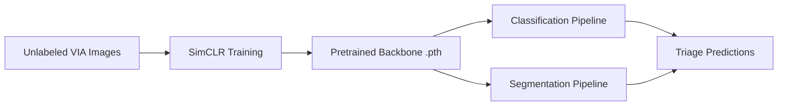

# 🧪 VIA Cervical Screening — ML Pipeline

This repository contains the full machine learning workflow for **automated cervical screening using VIA images**, including:

- Self-supervised backbone pretraining (SimCLR + ResNet50)  
- Classification models (baseline, transfer learning, and backbone-integrated)  
- Segmentation models (YOLO-based and improved with pretrained encoder)  
- Utility scripts and prototype GUI  

The goal is to build a scalable and reproducible experimentation framework for cervical disease detection and triage.

---

## 📂 Project Structure Overview

| Folder | Purpose |  
|--------|---------|  
| `resnet50_backbone/` | Self-supervised SimCLR training used to generate a domain-adapted backbone. |  
| `classification_expts/` | Classification experiments (baseline, transfer learning, and backbone-based). |  
| `segmentation_expts/` | Segmentation workflows (baseline YOLO and backbone-enhanced). |   
| `useful/` | Helper scripts for preprocessing and dataset formatting. |  
| `for_testing/` | Testing functions to try our best models out! | 

---

### 🔧 1. Self-Supervised Backbone (`resnet50_backbone/`)

This module pretrains a ResNet50 encoder using **SimCLR contrastive learning** on unlabeled cervical imaging datasets.

| File | Description |  
|------|------------|  
| `train_ssl.ipynb` | SimCLR pipeline with augmentations, NT-Xent loss, checkpointing. |  
| `checkpoints/` | Automatically saved backbone + projection head weights. |  
| `README.md` | How to finetune and integrate the pretrained encoder. |  

---

### 🧬 2. Classification Experiments (`classification_expts/`)

| File | Purpose |  
|------|---------|  
| `vgg_classification_run1.ipynb` | First run with VGG using augmented dataset from Roboflow. |  

---

### 🩺 3. Segmentation Experiments (`segmentation_expts/`)

| File | Purpose |  
|------|---------|  
| `yolo_segmentation.ipynb` | Yolo based segmentation experiments |  


### 🛠 5. Utility Scripts (`useful/`)

| File | Purpose |  
|------|---------|  
| `json2csv.py` | Converts annotations to CSV format for training. |  

---

## ⚙️ Requirements

- Python ≥ 3.9  
- PyTorch ≥ 2.0  
- CUDA-enabled GPU recommended  

Install dependencies:

```bash  
pip install -r requirements.txt  
```

---

## 🚀 Workflow Summary



---

## 📌 Citation

If you use this project in research or publications, please cite:

Chen et al., *A Simple Framework for Contrastive Learning of Visual Representations (SimCLR)*, 2020.

---

## 🏁 Project Status

| Component | Status |  
|----------|--------|  
| SimCLR Pretraining | Complete |  
| Classification Models | Improving |  
| Segmentation Models | In Progress |  
| GUI Prototype | Draft |  
